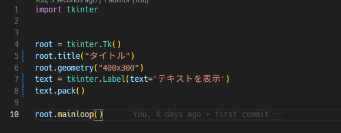

<!-- _class: title -->


<!--
_color: black
-->
---

# 今日のイベントについて
<br>

###### 最近話題の**言語モデル**と**Tkinter**というライブラリを使ってチャットアプリを作ろう！という勉強会です。

###### 全2回でこの第1回は言語モデルを自分のパソコンで動かし、かつTkinterを触ることができるというのがゴールになります。

###### 第2回では第1回で学んだことを活かしてAIとの対話形式のチャットアプリを作っていきます。

<br>

### 本日のイベントは北海道でITエンジニアを目指すU-25のためのコミュニティ未完Laboが主催します

---
# 未完Laboについて
#### 「**技術で地域を良くする。**」がコンセプトの未完Foundationが運営する、北海道・札幌のITに関わる全てのU-25のためのオンラインコミュニティです。

#### 「**技術を学ぶためには、まずは技術で遊び・研究・探求すること**」をモットーに「技術を学び、技術で遊ぶ」というコンセプトで運営されています。

---

# 自己紹介

#### 岩本宙士
###### Twitter:@Iwamoto_eng

##### pythonでbotや管理システム・小規模なAIアプリを作成

#####  バックエンドが好き、データ・AI大好き

##### 別で生成AIコミュニティのマネージャーもしてます


---

# LLMとは？
## 大規模言語モデルという意味

###### 多くのテキストデータから学習して文章を生成するAIモデル

## なぜ最近話題なのか？

###### 自然な応答、問題発言をしない、使いやすいインターフェースのアプリ

###### このハンズオンでは自分でチャットアプリを1から作ってみることで使いやすいインターフェースの凄さとchatGPTの精度の高さを実感出来ます

###### Llama2はMetaとMicrosoftが開発した大規模言語モデルで大きいモデルはGPT-3.5と同等の性能


---
# 何故Llama2？

## オープンソースで誰でも使えて商用利用も可能


###### 最近の言語モデルのトレンドは大規模化、その中でノートパソコンでも動かせる軽めの言語モデルでモデルさえあればオフライン環境で実行ができる


| モデル名| パラメータ数|
|-----------|-------------|
| GPT-4     | 100兆       |
| Bing AI   | 1兆         |
| GPT-3     | 1750億      |
| Llama2 70B| 700億       |


---
# Tkinterとは？

#### GUIアプリケーションを作ることができるPythonの標準ライブラリ


---
# Tkinterでチャットアプリを作るために必要な機能

<!-- _class: image -->


<!-- 横並びにしたい -->

---
# 開発環境を準備しよう

##### 1.好きな場所に今日の作業フォルダを作成する
##### 2.作成したフォルダをVSCodeで開く
##### 3.VSCodeの Terminal > New Terminal からターミナルを開く
##### 4.python -m venv .venv を実行します
##### 5.Mac / Windowsで以下のコマンドを実行してください
**Mac** ```.venv/bin/activate``` **Windows** `.venv/Scripts/activate`

---
# 開発環境を準備しよう

##### 1.VSCode上でmain.pyを作成
##### 2.画面の右上を確認して以下のような表記があればOK

##### 3.でなければ、拡張機能を左のメニューのExtensionsからインストール


---

# Llama2のモデルのダウンロードと環境構築

#### 1.discordに送信したLlama2ライセンスのコピーを読んでください
#### 2.discordに送信したモデルのダウンロードリンクからダウンロードしてください
#### 3.VSCodeのターミナルから以下のコマンドを実行してください
`pip install llama-cpp-python`

### ※コードやコマンドは全てdiscordのllama2アプリ第1回チャンネルにも貼っていきます

---

# 早速Llama2モデルを動かそう
`generate.py`


これだけでLlama2を動かして文章を生成することができます

---

# Tkinterでテキストを表示する

`first-tkinter.py`


**実行するとタイトルとテキストのみの単純なデスクトップアプリが表示されます**

---
# テキストボックスを作る

`textbox.py`


---

# ボタンに機能をつける

`make-button.py`


---

# ボタンを押した後の処理を追加する
`click-button.py`


---

# ※余裕がある人向け:Llama2の文章を翻訳しよう

### 以下のコマンドを実行してgoogletransのver4.0.0-rc1をインストールした後、下記のプログラムを実行する
`pip install googletrans==4.0.0-rc1`

`translate-jp.py`
